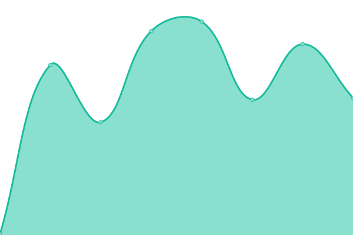

# [📈 Live Status](https://status.fletchto99.com): <!--live status--> **🟥 Complete outage**

This repository contains the open-source uptime monitor and status page for [Matthew Langlois](https://fletchto99.com), powered by [Upptime](https://github.com/upptime/upptime).

With [Upptime](https://upptime.js.org), you can get your own unlimited and free uptime monitor and status page, powered entirely by a GitHub repository. We use [Issues](https://github.com/fletchto99/status.fletchto99.com/issues) as incident reports, [Actions](https://github.com/fletchto99/status.fletchto99.com/actions) as uptime monitors, and [Pages](https://status.fletchto99.com) for the status page.

<!--start: status pages-->
<!-- This summary is generated by Upptime (https://github.com/upptime/upptime) -->
<!-- Do not edit this manually, your changes will be overwritten -->
<!-- prettier-ignore -->
| URL | Status | History | Response Time | Uptime |
| --- | ------ | ------- | ------------- | ------ |
|  [Home](https://home.fletchto99.com) | 🟥 Down | [home.yml](https://github.com/fletchto99/status.fletchto99.com/commits/HEAD/history/home.yml) | 

 200ms
     
 | 

<a href="https://status.fletchto99.com/history/home">86.72%</a>
    

|  Blog | 🟥 Down | [blog.yml](https://github.com/fletchto99/status.fletchto99.com/commits/HEAD/history/blog.yml) | 

 270ms
     
 | 

<a href="https://status.fletchto99.com/history/blog">86.72%</a>
    

|  Cloud | 🟥 Down | [cloud.yml](https://github.com/fletchto99/status.fletchto99.com/commits/HEAD/history/cloud.yml) | 

 306ms
     
 | 

<a href="https://status.fletchto99.com/history/cloud">86.73%</a>
    

|  Images | 🟥 Down | [images.yml](https://github.com/fletchto99/status.fletchto99.com/commits/HEAD/history/images.yml) | 

 287ms
     
 | 

<a href="https://status.fletchto99.com/history/images">86.73%</a>
    

|  Media | 🟥 Down | [media.yml](https://github.com/fletchto99/status.fletchto99.com/commits/HEAD/history/media.yml) | 

 179ms
     
 | 

<a href="https://status.fletchto99.com/history/media">86.74%</a>
    

|  Request | 🟥 Down | [request.yml](https://github.com/fletchto99/status.fletchto99.com/commits/HEAD/history/request.yml) | 

 176ms
     
 | 

<a href="https://status.fletchto99.com/history/request">86.74%</a>
    

|  Backups | 🟥 Down | [backups.yml](https://github.com/fletchto99/status.fletchto99.com/commits/HEAD/history/backups.yml) | 

 166ms
     
 | 

<a href="https://status.fletchto99.com/history/backups">86.75%</a>
    

<!--end: status pages-->

[**Visit our status website →**](https://status.fletchto99.com)

## 📄 License

- Powered by: [Upptime](https://github.com/upptime/upptime)
- Code: [MIT](./LICENSE) © [Matthew Langlois](https://fletchto99.com)
- Data in the `./history` directory: [Open Database License](https://opendatacommons.org/licenses/odbl/1-0/)
